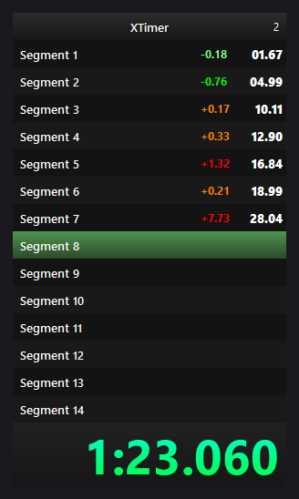

# XTimer
**XTimer is a fast and feauture-full speedrun timer made in C++**
|-|
|  |
## Features
- Time synchronization with system clock with high precision down to microseconds;
- Absolute zero timer control latency;
- Easy to use C++ API to communicate with the timer from anywhere;
- Configurable layout;
- Customizable UI;
- High performance and light weight;
## Timer control
XTimer is supposed to be controlled automatically from the game code itself or third party extensions. The socket is always open while XTimer is running, you can compile XTimerAPI into .lib manually for either windows or unix, or just take the one that matches your architecture from Releases.

See [xtimer_api.h](https://github.com/Vidzhet/XTimer/blob/main/XTimerAPI/xtimer_api.h) for more info.

No API initialization is required. You just call API functions and timer responses.
```cpp
void OnGamePauseExample() {
  xtimer::pause(); // etc.
}

void OnGameLoadExample() {
  xtimer::set_time_ms(game->time_ms_count);
}
```

## Settings
You can create, edit, and share both run and timer configs.
### Theming
XTimer supports dynamic resizing, custom background, custom coloring, custom fonts, window rounding, transparency, and more!

## Contributing & Building
You need Qt6 and CMake. See [build.bat](https://github.com/Vidzhet/XTimer/blob/main/build.bat) for windows. I use msvc Qt packages, you may have to specify the path manually.

Feel free to contribute to this project. All sorts of different API bindings as an addition are welcomed!

~~vidzhet
